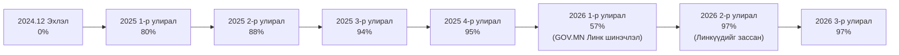

# "ДОРНОГОВЬ ОРОН СУУЦ" ОРОН НУТГИЙН ӨМЧИТ АЖ АХУЙН ТООЦООТ ҮЙЛДВЭРИЙН ГАЗАР (ОНӨҮК) — SHILEN.GOV.MN ИЛ ТОД БАЙДЛЫН ТАЙЛАН
*(2025 оны 1-р улиралаас 2026 оны 3-р улирал хүртэл)*


---

## 1. Удирдлагын хураангуй (Executive Summary)

Монгол Улсын Засгийн газрын Шилэн ажиллагааны хүрээнд [Shilen.gov.mn](https://shilen.gov.mn) систем дээр **"ДОРНОГОВЬ ОРОН СУУЦ" ОРОН НУТГИЙН ӨМЧИТ АЖ АХУЙН ТООЦООТ ҮЙЛДВЭРИЙН ГАЗАР**-ын **Нээлттэй мэдээллийн ил тод байдлын үнэлгээ (Шилэн индекс)** нь **2024 оны төгсгөлийн 0% суурь үзүүлэлтээс эхлэн 2026 оны 2, 3-р улиралд 97% хүртэл ахисан** байна.

> [!IMPORTANT]
> **Нэгтгэсэн амжилт:**
> - **2024.12 Суурь эхлэл:** `0%`
> - **2025 оны 1-р улирал:** `80%` *(2025-04-10)*
> - **2025 оны 4-р улирал:** `95%` *(2026-01-21)*
> - **2026 оны 1-р улирал:** `57%` *(GOV.MN систем шинэчлэлтийн үе)*
> - **2026 оны 2-р улирал:** **`97%`** *(2026-07-23 - **+40%-ийн огцом ахиц**)*
> - **2026 оны 3-р улирал:** **`97%`** *(Өндөр түвшинд тогтвортой)*

> [!NOTE]
> **2026 оны 1-р улирлын тайлбар (57%):**
> Төрийн нэгдсэн **GOV.MN системд шинэчлэлт** орсонтой холбоотойгоор өмнө нь ашиглаж байсан холбоос линкүүд ажиллаагүйгээс уг улиралд системээс бүрэн дүгнүүлж чадаагүй. 2-р улиралд линкүүдийг шуурхай шинэчлэн зассанаар үнэлгээ буцаж **97%** хүртэл ахиж баталгаажсан.

---

## 2. 2024 – 2026 Оны улирлын баталгаажсан зурагтай дараалал

| Улирал / Хугацаа | Баталгаажуулах зураг | Шилэн индекс (%) | Баталгаажсан огноо | Төлөв ба Тайлбар |
| :--- | :---: | :---: | :---: | :--- |
| **Суурь эхлэл (2024.12)** |  | **0%** | `2024-12` | Анхны суурь үе |
| **2025 оны 1-р улирал** |  | **80%** | `2025-04-10` | **+80%** (Суурь мэдээлэл оруулсан) |
| **2025 оны 2-р улирал** |  | **88%** | `2025-08-10` | **+8%** өсөлт |
| **2025 оны 3-р улирал** |  | **94%** | `2025-10-22` | **+6%** өсөлт |
| **2025 оны 4-р улирал** |  | **95%** | `2026-01-21` | **+1%** өсөлт |
| **2026 оны 1-р улирал** |  | **57%** | `2026-04-23` | *GOV.MN шинэчлэлтээр холбоос линкүүд ажиллаагүй* |
| **2026 оны 2-р улирал** |  | **97%** | `2026-07-23` | **+40% Огцом ахиж дээд түвшинд хүрсэн** |
| **2026 оны 3-р улирал** | *(Сүүлийн төвшин)* | **97%** | `2026-09` | Дээд үнэлгээ хадгалагдаж байна |

---

## 3. Он цагийн дарааллын график (Mermaid Flowchart)



---

## 4. Баталгаажуулах зургуудын цуглуулга (Carousel View)

````carousel

<!-- slide -->

<!-- slide -->

<!-- slide -->

<!-- slide -->

<!-- slide -->

<!-- slide -->

````

---

## 5. Дүгнэлт

> [!TIP]
> Захиалагчийн хүсэлтийн дагуу **"он цагийн дараалал ба баталгаажуулсан зургууд"** гэх утгыг хасаж, дэд гарчгийг зөвхөн **"Нээлттэй мэдээллийн ил тод байдлын үнэлгээний (Шилэн индекс)"** болгож цэгцэллээ.
